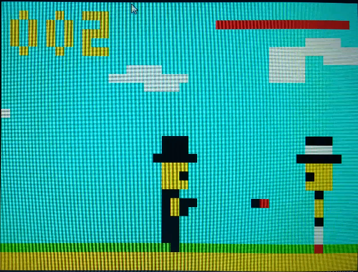

# Pistoleiro Paco

This project was made for a college class.

The idea is to make a small console to run games on arduino using a VGA screen and a simple controller.

# Controller

The controller has 6 buttons, four to move around, one to go back and one to select (or shoot).

# Screen

The screen has a 40x30 resolution and 8 possible colors for pixels (3 bits, for each RGB color).

# Planning

First, we made a program that draws the pixels on the screen.

After, instead of doing the game using the arduino (that would take way longer to test),
we made a small interface using the allegro library to make the game and after, we just ported
the whole code to the arduino.

That helped making the game way faster.

# Game

There are two games, Pistoleiro Paco (the main game) and Snake.

# Pistoleiro Paco

# Snake

[Snake screen](https://i.imgur.com/hcuwHCf.gif)
